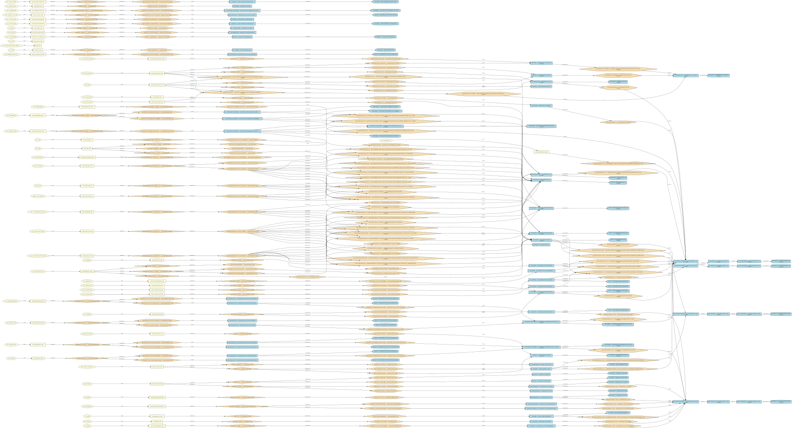

# endpoint-graph
## Why this tool exists
This tool was built to construct dependency graphs for the bee project.

Bee has more than a hundred packages — too large to map by hand. LLM output depends on model and prompt, which makes results non-deterministic and the process hard to debug.

`endpoint-graph` walks the code statically (SSA + AST) and builds a **reproducible** graph: which bee entities are reached from a handler or entry point, via which fields and interfaces.



## What this tool does

- Walk bee code from **two entry points**: `pkg/node` (`NewBee`) and `pkg/api` (HTTP handlers).
- Build a graph for a **single endpoint** or **all endpoints**
- **Merge** — combine per-endpoint graphs into one `merged.json`.

A single graph of the entire project is too large to analyze even with AI; the tool deliberately works **per endpoint** or **per entry point**.
Graphs show only bee packages and entities. Third-party libraries and stdlib are **not** shown.

### Output formats

| Format      | How to obtain                                   |
|-------------|-------------------------------------------------|
| **JSON**    | `-stdout -format json` or `graph.json` files    |
| **SVG**     | default with `-svg=true` (requires `dot`)       |
| **GraphML** | `export-yed` (for yEd; requires `dot`)          |

By default, graphs are built in **direct-calls** mode (method-level capabilities, wiring layer).

## How to use it
**Note:** the tool is not 100% precise. It is meant to give a high-level picture of dependencies.

### Prerequisites
- **Go 1.26+** (see `go.mod`)
- **Bee repository** with `go.mod` containing `github.com/ethersphere/bee/v2`
- **graphviz** — `dot` binary on `PATH` (for `.svg` and layout in `.graphml`)
- Enough RAM/CPU for SSA analysis: a full `-all` over all endpoints may take **several minutes**

### Build
```bash
go build -o endpoint-graph .
```

### Bee and output paths

| Flag   | Purpose                                                       |
|--------|---------------------------------------------------------------|
| `-bee` | Path to bee repo root (absolute or relative)                  |
| `-out` | Output directory for graphs (created automatically)           |

Positional args after flags: `./endpoint-graph … /path/to/bee [/path/to/graphs]`

Examples below use variables:

```bash
BEE=/home/user/code/bee
GRAPHS=/home/user/graphs
```

---

### 1. Graph for one endpoint

```bash
./endpoint-graph \
  -bee=$BEE \
  -out=$GRAPHS \
  -method GET \
  -path /accounting
```

Output: `$GRAPHS/GET_accounting/graph.json` and `graph.svg`.

JSON to stdout:

```bash
./endpoint-graph \
  -bee=$BEE \
  -method GET -path /accounting \
  -stdout -format json
```

---

### 2. Graphs for all endpoints

```bash
./endpoint-graph \
  -bee=$BEE \
  -out=$GRAPHS \
  -all
```

Output: `$GRAPHS/<METHOD_name>/graph.{json,svg}` for each route from `router.go`.

Optional: `-index`, `-shared`, `-index-md`, `-text-out`.

---

### 3. Merged graph from all endpoints

First per-endpoint graphs (step 2), then merge:

```bash
./endpoint-graph \
  -bee=$BEE \
  -out=$GRAPHS \
  -all

./endpoint-graph merge \
  -in=$GRAPHS \
  -out=$GRAPHS/merged.json
```

Optional SVG: `-svg=$GRAPHS/merged.svg` on the `merge` command, or separately:

```bash
./endpoint-graph render-merged \
  -in=$GRAPHS/merged.json \
  -svg=$GRAPHS/merged.svg
```

Filter by mount group: `merge -mount mountAPI -out=$GRAPHS/merged-mountAPI.json`.

---

### 4. Graph from entry point `pkg/node`

```bash
./endpoint-graph node \
  -bee=$BEE \
  -out=$GRAPHS/node
```

Default: analyzes `pkg/node.NewBee` → `$GRAPHS/node/node.{json,svg}`.

Equivalent via subcommand:

```bash
./endpoint-graph entry \
  -bee=$BEE \
  -out=$GRAPHS/node \
  -entry node
```

Surfaces subsystems that do not appear on HTTP paths (pushsync, pullsync, retrieval, storageincentives, …).

---

### 5. Export to GraphML

```bash
./endpoint-graph export-yed \
  -in=$GRAPHS/merged.json \
  -graphml=$GRAPHS/merged.graphml
```

Per-endpoint:

```bash
./endpoint-graph export-yed \
  -in=$GRAPHS/GET_accounting/graph.json \
  -graphml=$GRAPHS/GET_accounting/graph.graphml
```

Highlight essential packages in red (optional): `-essential-color=true`.

---
## Flag reference
| Flag                 | Default               | Description                       |
|----------------------|-----------------------|-----------------------------------|
| `-bee`               | `../../../code/bee`   | Bee repo root                     |
| `-out`               | `<tool>/graphs`       | Output directory                  |
| `-method` / `-path`  | —                     | Filter one endpoint               |
| `-handler`           | —                     | Analyze by handler name           |
| `-all`               | false                 | All endpoints                     |
| `-direct-calls`      | true                  | Method-level capabilities         |
| `-compress-packages` | false                 | Collapse to one package node      |
| `-svg`               | true                  | Render `.svg`                     |
| `-stdout`            | false                 | Write to stdout                   |
| `-format`            | text                  | Stdout: `text`, `json`            |

Subcommands: `merge`, `render-merged`, `export-yed`, `node`, `entry`.
